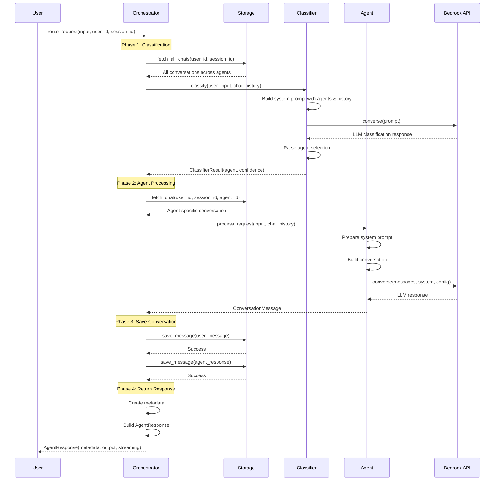

# Agent Squad - Data Flow Diagram

## Complete Request Flow Visualization

This document provides comprehensive data flow diagrams showing how user requests flow through the Agent Squad framework.

---

## 1. High-Level Data Flow

```
┌─────────────────────────────────────────────────────────────────────────────┐
│                              USER REQUEST                                   │
│  {                                                                          │
│    user_input: "I need help with my billing",                               │
│    user_id: "user_123",                                                     │
│    session_id: "session_456",                                               │
│    additional_params: {}                                                    │
│  }                                                                          │
└────────────────────────────────┬────────────────────────────────────────────┘
                                 │
                                 ▼
┌─────────────────────────────────────────────────────────────────────────────┐
│                         ORCHESTRATOR                                        │
│                      (AgentSquad.route_request)                             │
│                                                                             │
│  Step 1: Clear execution times                                              │
│  Step 2: Call classify_request()                                            │
│  Step 3: Call agent_process_request()                                       │
│  Step 4: Log execution times                                                │
└────┬───────────────────────────┬────────────────────────────┬───────────────┘
     │                           │                            │
     │ 1. Classify               │ 2. Process                 │ 3. Save & Return
     ▼                           ▼                            ▼
┌─────────────┐          ┌──────────────┐           ┌─────────────────┐
│ CLASSIFIER  │          │    AGENT     │           │    STORAGE      │
│             │          │              │           │                 │
│ Analyze     │          │ Generate     │           │ Persist         │
│ Intent      │          │ Response     │           │ Conversation    │
└─────────────┘          └──────────────┘           └─────────────────┘
     │                           │                            │
     │ ClassifierResult          │ ConversationMessage        │ Success
     ▼                           ▼                            ▼
┌─────────────────────────────────────────────────────────────────────────────┐
│                         RESPONSE TO USER                                    │
│  AgentResponse {                                                            │
│    metadata: {                                                              │
│      user_input: "I need help with my billing",                             │
│      agent_id: "billing-agent",                                             │
│      agent_name: "Billing Agent",                                           │
│      user_id: "user_123",                                                   │
│      session_id: "session_456"                                              │
│    },                                                                       │
│    output: ConversationMessage {                                            │
│      role: "assistant",                                                     │
│      content: [{"text": "I'd be happy to help with billing..."}]            │
│    },                                                                       │
│    streaming: false                                                         │
│  }                                                                          │
└─────────────────────────────────────────────────────────────────────────────┘
```

---

## 2. Detailed Data Flow with Data Transformations

### Phase 1: Request Initialization

```
USER INPUT
│
│  Data: {
│    user_input: "I need help with my billing"
│    user_id: "user_123"
│    session_id: "session_456"
│    additional_params: {}
│    stream_response: false
│  }
│
▼
┌──────────────────────────────────────────────────────────────┐
│ Orchestrator.route_request()                                 │
│                                                              │
│ Actions:                                                     │
│ 1. self.execution_times.clear()                              │
│ 2. Call classify_request(user_input, user_id, session_id)    │
└───────────────────────────┬──────────────────────────────────┘
                            │
                            ▼
```

### Phase 2: Classification

```
┌──────────────────────────────────────────────────────────────┐
│ Orchestrator.classify_request()                              │
│                                                              │
│ Step 2.1: Fetch conversation history                         │
└───────────────────────────┬──────────────────────────────────┘
                            │
                            ▼
┌──────────────────────────────────────────────────────────────┐
│ Storage.fetch_all_chats(user_id, session_id)                 │
│                                                              │
│ Query: user_123#session_456#*                                │
└───────────────────────────┬──────────────────────────────────┘
                            │
                            │ Returns conversation history
                            ▼
                    ┌─────────────────────-┐
                    │ Conversation History │
                    │ [                    │
                    │   {                  │
                    │     role: "user",    │
                    │     content: [{      │
                    │       text: "Book a  │
                    │       flight to NYC" │
                    │     }]               │
                    │   },                 │
                    │   {                  │
                    │     role: "assistant"│
                    │     content: [{      │
                    │       text: "[travel-│
                    │       agent] I can   │
                    │       help..."       │
                    │     }]               │
                    │   },                 │
                    │   {                  │
                    │     role: "user",    │
                    │     content: [{      │
                    │       text: "I need  │
                    │       help with my   │
                    │       billing"       │
                    │     }]               │
                    │   }                  │
                    │ ]                    │
                    └──────────┬───────────┘
                               │
                               ▼
┌──────────────────────────────────────────────────────────────┐
│ Classifier.classify(user_input, chat_history)                │
│                                                              │
│ Step 2.2: Format history & build system prompt               │
└───────────────────────────┬──────────────────────────────────┘
                            │
                            ▼
┌──────────────────────────────────────────────────────────────┐
│ Classifier.set_history(chat_history)                         │
│                                                              │
│ Transforms to:                                               │
│ "user: Book a flight to NYC                                  │
│  assistant: [travel-agent] I can help...                     │
│  user: I need help with my billing"                          │
└───────────────────────────┬──────────────────────────────────┘
                            │
                            ▼
┌──────────────────────────────────────────────────────────────┐
│ Classifier.update_system_prompt()                            │
│                                                              │
│ Variables:                                                   │
│ - AGENT_DESCRIPTIONS:                                        │
│   "billing-agent: Handles billing and payments               │
│    tech-agent: Technical support                             │
│    travel-agent: Books flights and hotels"                   │
│                                                              │
│ - HISTORY:                                                   │
│   "user: Book a flight to NYC                                │
│    assistant: [travel-agent] I can help...                   │
│    user: I need help with my billing"                        │
│                                                              │
│ Result: Full classification prompt                           │
└───────────────────────────┬──────────────────────────────────┘
                            │
                            ▼
┌──────────────────────────────────────────────────────────────┐
│ BedrockClassifier.process_request()                          │
│                                                              │
│ LLM Input:                                                   │
│ {                                                            │
│   modelId: "anthropic.claude-3-5-sonnet...",                 │
│   messages: [{                                               │
│     role: "user",                                            │
│     content: [{                                              │
│       text: "I need help with my billing"                    │
│     }]                                                       │
│   }],                                                        │
│   system: [{                                                 │
│     text: "You are AgentMatcher... [full prompt]"            │
│   }],                                                        │
│   inferenceConfig: {                                         │
│     maxTokens: 500,                                          │
│     temperature: 0.0                                         │
│   }                                                          │
│ }                                                            │
└───────────────────────────┬──────────────────────────────────┘
                            │
                            │ Bedrock API Call
                            ▼
                    ┌─────────────────┐
                    │  AWS Bedrock    │
                    │  Converse API   │
                    └────────┬────────┘
                             │
                             │ LLM Response
                             ▼
                    ┌─────────────────────┐
                    │ "userinput: I need   │
                    │  help with my        │
                    │  billing             │
                    │  selected_agent:     │
                    │  billing-agent       │
                    │  confidence: 0.95"   │
                    └──────────┬───────────┘
                               │
                               ▼
┌──────────────────────────────────────────────────────────────┐
│ Parse Response & Create ClassifierResult                     │
│                                                              │
│ Extract:                                                     │
│ - agent_id = "billing-agent"                                 │
│ - confidence = 0.95                                          │
│ - selected_agent = agents["billing-agent"]                   │
└───────────────────────────┬──────────────────────────────────┘
                            │
                            │ Returns
                            ▼
                    ┌─────────────────────┐
                    │ ClassifierResult {  │
                    │   selected_agent:   │
                    │     BillingAgent,   │
                    │   confidence: 0.95  │
                    │ }                   │
                    └──────────┬───────────┘
                               │
                               ▼ Back to Orchestrator
```

### Phase 3: Agent Processing

```
┌──────────────────────────────────────────────────────────────┐
│ Orchestrator.agent_process_request()                         │
│                                                              │
│ Input:                                                       │
│ - user_input: "I need help with my billing"                  │
│ - classifier_result: ClassifierResult                        │
│ - selected_agent: BillingAgent                               │
└───────────────────────────┬──────────────────────────────────┘
                            │
                            │ Step 3.1: Fetch agent history
                            ▼
┌──────────────────────────────────────────────────────────────┐
│ Storage.fetch_chat(user_123, session_456, billing-agent)     │
│                                                              │
│ Query: user_123#session_456#billing-agent                    │
└───────────────────────────┬──────────────────────────────────┘
                            │
                            │ Returns (empty - first interaction)
                            ▼
                    ┌─────────────────┐
                    │ agent_chat =    │
                    │ []              │
                    └────────┬────────┘
                             │
                             ▼
┌──────────────────────────────────────────────────────────────┐
│ Orchestrator.dispatch_to_agent()                             │
│                                                              │
│ Parameters:                                                  │
│ {                                                            │
│   user_input: "I need help with my billing",                 │
│   user_id: "user_123",                                       │
│   session_id: "session_456",                                 │
│   classifier_result: ClassifierResult,                       │
│   additional_params: {}                                      │
│ }                                                            │
└───────────────────────────┬──────────────────────────────────┘
                            │
                            ▼
┌──────────────────────────────────────────────────────────────┐
│ BillingAgent.process_request()                               │
│                                                              │
│ Input:                                                       │
│ - input_text: "I need help with my billing"                  │
│ - user_id: "user_123"                                        │
│ - session_id: "session_456"                                  │
│ - chat_history: []                                           │
│ - additional_params: {}                                      │
└───────────────────────────┬──────────────────────────────────┘
                            │
                            │ Step 3.2: Prepare system prompt
                            ▼
┌──────────────────────────────────────────────────────────────┐
│ BedrockLLMAgent._prepare_system_prompt()                     │
│                                                              │
│ 1. Start with template:                                      │
│    "You are a Billing Agent. Handles billing and payments.   │
│     You will engage in conversation..."                      │
│                                                              │
│ 2. If retriever configured:                                  │
│    retrieved_context = retriever.retrieve(input_text)        │
│    system_prompt += context                                  │
│                                                              │
│ Result: Complete system prompt                               │
└───────────────────────────┬──────────────────────────────────┘
                            │
                            │ Step 3.3: Build conversation
                            ▼
┌──────────────────────────────────────────────────────────────┐
│ BedrockLLMAgent._prepare_conversation()                      │
│                                                              │
│ conversation = [                                             │
│   ...chat_history,  // Empty in this case                    │
│   {                                                          │
│     role: "user",                                            │
│     content: [{                                              │
│       text: "I need help with my billing"                    │
│     }]                                                       │
│   }                                                          │
│ ]                                                            │
└───────────────────────────┬──────────────────────────────────┘
                            │
                            │ Step 3.4: Build API command
                            ▼
┌──────────────────────────────────────────────────────────────┐
│ BedrockLLMAgent._build_conversation_command()                │
│                                                              │
│ command = {                                                  │
│   modelId: "anthropic.claude-3-haiku-20240307-v1:0",         │
│   messages: [                                                │
│     {                                                        │
│       role: "user",                                          │
│       content: [                                             │
│         {text: "I need help with my billing"}                │
│       ]                                                      │
│     }                                                        │
│   ],                                                         │
│   system: [                                                  │
│     {text: "You are a Billing Agent..."}                     │
│   ],                                                         │
│   inferenceConfig: {                                         │
│     maxTokens: 1000,                                         │
│     temperature: 0.0,                                        │
│     topP: 0.9                                                │
│   }                                                          │
│ }                                                            │
└───────────────────────────┬──────────────────────────────────┘
                            │
                            │ Step 3.5: Call LLM
                            ▼
┌──────────────────────────────────────────────────────────────┐
│ BedrockLLMAgent.handle_single_response()                     │
│                                                              │
│ client.converse(**command)                                   │
└───────────────────────────┬──────────────────────────────────┘
                            │
                            │ Bedrock API Call
                            ▼
                    ┌─────────────────┐
                    │  AWS Bedrock    │
                    │  Converse API   │
                    └────────┬────────┘
                             │
                             │ LLM Response
                             ▼
                    ┌────────────────────────────-──┐
                    │ {                             │
                    │   output: {                   │
                    │     message: {                │
                    │       role: "assistant",      │
                    │       content: [              │
                    │         {                     │
                    │           text: "I'd be happy │
                    │           to help with your   │
                    │           billing. Could you  │
                    │           please tell me what │
                    │           specific issue you  │
                    │           are experiencing?"  │
                    │         }                     │
                    │       ]                       │
                    │     }                         │
                    │   },                          │
                    │   usage: {                    │
                    │     inputTokens: 245,         │
                    │     outputTokens: 32          │
                    │   }                           │
                    │ }                             │
                    └──────────┬────────────────────┘
                               │
                               ▼
┌──────────────────────────────────────────────────────────────┐
│ Transform to ConversationMessage                             │
│                                                              │
│ llm_response = ConversationMessage {                         │
│   role: "assistant",                                         │
│   content: [                                                 │
│     {                                                        │
│       text: "I'd be happy to help with your billing..."      │
│     }                                                        │
│   ]                                                          │
│ }                                                            │
└───────────────────────────┬──────────────────────────────────┘
                            │
                            │ Returns to Orchestrator
                            ▼
```

### Phase 4: Save Conversation

```
┌──────────────────────────────────────────────────────────────┐
│ Orchestrator.agent_process_request() - Save Phase            │
│                                                              │
│ Step 4.1: Save user message                                  │
└───────────────────────────┬──────────────────────────────────┘
                            │
                            ▼
┌──────────────────────────────────────────────────────────────┐
│ Storage.save_chat_message()                                  │
│                                                              │
│ Input:                                                       │
│ - user_id: "user_123"                                        │
│ - session_id: "session_456"                                  │
│ - agent_id: "billing-agent"                                  │
│ - message: {                                                 │
│     role: "user",                                            │
│     content: [{text: "I need help with my billing"}]         │
│   }                                                          │
│ - max_history_size: 100                                      │
└───────────────────────────┬──────────────────────────────────┘
                            │
                            ▼
┌──────────────────────────────────────────────────────────────┐
│ InMemoryChatStorage.save_chat_message()                      │
│                                                              │
│ 1. Generate key: "user_123#session_456#billing-agent"        │
│ 2. Get current conversation: []                              │
│ 3. Check for consecutive same-role: false                    │
│ 4. Create TimestampedMessage:                                │
│    {                                                         │
│      role: "user",                                           │
│      content: [{text: "I need help with my billing"}],       │
│      timestamp: 1707936000000                                │
│    }                                                         │
│ 5. Append to conversation                                    │
│ 6. Trim to max_history_size                                  │
│ 7. Store in self.conversations                               │
└───────────────────────────┬──────────────────────────────────┘
                            │
                            │ Storage State:
                            ▼
                ┌───────────────────────────────-─────┐
                │ conversations = {                   │
                │   "user_123#session_456#billing-    │
                │    agent": [                        │
                │     {                               │
                │       role: "user",                 │
                │       content: [{...}],             │
                │       timestamp: 1707936000000      │
                │     }                               │
                │   ]                                 │
                │ }                                   │
                └────────────┬────────────────────────┘
                             │
                             │ Step 4.2: Save agent message
                             ▼
┌──────────────────────────────────────────────────────────────┐
│ Storage.save_chat_message()                                  │
│                                                              │
│ Input:                                                       │
│ - user_id: "user_123"                                        │
│ - session_id: "session_456"                                  │
│ - agent_id: "billing-agent"                                  │
│ - message: {                                                 │
│     role: "assistant",                                       │
│     content: [{text: "I'd be happy to help..."}]             │
│   }                                                          │
└───────────────────────────┬──────────────────────────────────┘
                            │
                            ▼
                ┌──────────────────────────────────-──┐
                │ conversations = {                   │
                │   "user_123#session_456#billing-    │
                │    agent": [                        │
                │     {                               │
                │       role: "user",                 │
                │       content: [{...}],             │
                │       timestamp: 1707936000000      │
                │     },                              │
                │     {                               │
                │       role: "assistant",            │
                │       content: [{...}],             │
                │       timestamp: 1707936002000      │
                │     }                               │
                │   ]                                 │
                │ }                                   │
                └────────────┬────────────────────────┘
                             │
                             ▼
```

### Phase 5: Build & Return Response

```
┌──────────────────────────────────────────────────────────────┐
│ Orchestrator.agent_process_request() - Return Phase          │
│                                                              │
│ Step 5.1: Create metadata                                    │
└───────────────────────────┬──────────────────────────────────┘
                            │
                            ▼
┌──────────────────────────────────────────────────────────────┐
│ Orchestrator.create_metadata()                               │
│                                                              │
│ metadata = AgentProcessingResult {                           │
│   user_input: "I need help with my billing",                 │
│   agent_id: "billing-agent",                                 │
│   agent_name: "Billing Agent",                               │
│   user_id: "user_123",                                       │
│   session_id: "session_456",                                 │
│   additional_params: {}                                      │
│ }                                                            │
└───────────────────────────┬──────────────────────────────────┘
                            │
                            │ Step 5.2: Create AgentResponse
                            ▼
┌──────────────────────────────────────────────────────────────┐
│ Build AgentResponse                                          │
│                                                              │
│ response = AgentResponse {                                   │
│   metadata: AgentProcessingResult {...},                     │
│   output: ConversationMessage {                              │
│     role: "assistant",                                       │
│     content: [{                                              │
│       text: "I'd be happy to help with your billing..."      │
│     }]                                                       │
│   },                                                         │
│   streaming: false                                           │
│ }                                                            │
└───────────────────────────┬──────────────────────────────────┘
                            │
                            │ Step 5.3: Log execution times
                            ▼
┌──────────────────────────────────────────────────────────────┐
│ Logger.print_execution_times()                               │
│                                                              │
│ Execution Times:                                             │
│ - Classifying user intent: 0.823s                            │
│ - Agent Billing Agent | Processing request: 1.234s           │
│ - Total: 2.057s                                              │
└───────────────────────────┬──────────────────────────────────┘
                            │
                            │ Return to caller
                            ▼
┌──────────────────────────────────────────────────────────────┐
│                    FINAL RESPONSE                            │
│                                                              │
│ AgentResponse {                                              │
│   metadata: {                                                │
│     user_input: "I need help with my billing",               │
│     agent_id: "billing-agent",                               │
│     agent_name: "Billing Agent",                             │
│     user_id: "user_123",                                     │
│     session_id: "session_456",                               │
│     additional_params: {}                                    │
│   },                                                         │
│   output: {                                                  │
│     role: "assistant",                                       │
│     content: [                                               │
│       {                                                      │
│         text: "I'd be happy to help with your billing.       │
│               Could you please tell me what specific issue   │
│               you are experiencing?"                         │
│       }                                                      │
│     ]                                                        │
│   },                                                         │
│   streaming: false                                           │
│ }                                                            │
└──────────────────────────────────────────────────────────────┘
```

---

## 3. Streaming Response Data Flow

```
USER REQUEST (with streaming enabled)
│
│  stream_response: true
│
▼
┌──────────────────────────────────────────────────────────────┐
│ Same classification phase as above...                        │
│ ...                                                          │
│ Agent selected: BillingAgent (streaming=true)                │
└───────────────────────────┬──────────────────────────────────┘
                            │
                            ▼
┌──────────────────────────────────────────────────────────────┐
│ BedrockLLMAgent._handle_streaming()                          │
│                                                              │
│ Step 1: Create async stream_generator()                      │
└───────────────────────────┬──────────────────────────────────┘
                            │
                            ▼
┌──────────────────────────────────────────────────────────────┐
│ BedrockLLMAgent.handle_streaming_response()                  │
│                                                              │
│ response = client.converse_stream(**command)                 │
└───────────────────────────┬──────────────────────────────────┘
                            │
                            │ Bedrock Streaming API
                            ▼
                    ┌─────────────────┐
                    │  AWS Bedrock    │
                    │  Streaming      │
                    └────────┬────────┘
                             │
                             │ Stream chunks
                             ▼
┌──────────────────────────────────────────────────────────────┐
│ Process Stream Chunks                                        │
│                                                              │
│ Chunk 1: {messageStart: {role: "assistant"}}                 │
│   → Initialize message                                       │
│                                                              │
│ Chunk 2: {contentBlockDelta: {delta: {text: "I'd"}}}         │
│   → accumulated_text += "I'd"                                │
│   → yield AgentStreamResponse(text="I'd")                    │
│                                                              │
│ Chunk 3: {contentBlockDelta: {delta: {text: " be"}}}         │
│   → accumulated_text += " be"                                │
│   → yield AgentStreamResponse(text=" be")                    │
│                                                              │
│ Chunk 4: {contentBlockDelta: {delta: {text: " happy"}}}      │
│   → accumulated_text += " happy"                             │
│   → yield AgentStreamResponse(text=" happy")                 │
│                                                              │
│ ... (more chunks) ...                                        │
│                                                              │
│ Final Chunk: {contentBlockStop: {}}                          │
│   → Create final_message                                     │
│   → yield AgentStreamResponse(                               │
│       final_message=ConversationMessage(...)                 │
│     )                                                        │
└───────────────────────────┬──────────────────────────────────┘
                            │
                            │ Stream yields go back to orchestrator
                            ▼
┌──────────────────────────────────────────────────────────────┐
│ Orchestrator.agent_process_request() - Streaming Handler     │
│                                                              │
│ async def process_stream():                                  │
│     full_message = None                                      │
│     async for chunk in agent_response:                       │
│         if chunk.final_message:                              │
│             full_message = chunk.final_message               │
│         yield chunk  # Yield to user immediately             │
│                                                              │
│     # Save after streaming completes                         │
│     await storage.save_message(full_message, ...)            │
└───────────────────────────┬──────────────────────────────────┘
                            │
                            │ Returns async generator
                            ▼
┌──────────────────────────────────────────────────────────────┐
│ Build Streaming AgentResponse                                │
│                                                              │
│ response = AgentResponse {                                   │
│   metadata: {...},                                           │
│   output: async_generator,  // Not ConversationMessage!      │
│   streaming: true                                            │
│ }                                                            │
└───────────────────────────┬──────────────────────────────────┘
                            │
                            │ Return to user
                            ▼
┌────────────────────────────────────────────────────────────-──┐
│ USER CONSUMES STREAM                                          │
│                                                               │
│ if response.streaming:                                        │
│     async for chunk in response.output:                       │
│         print(chunk.text, end='')  # "I'd" "be" "happy"...    |
│                                                               │
│         if chunk.final_message:                               │
│             # Complete message available                      │
│             full_text = chunk.final_message.content[0]['text']│
└────────────────────────────────────────────────────────────-──┘
```

---

## 4. Tool Calling Data Flow

```
USER REQUEST: "What's the weather in Seattle?"
│
▼
[Same classification and agent selection...]
│
▼ Selected: WeatherAgent (has get_weather tool)
│
┌──────────────────────────────────────────────────────────────┐
│ BedrockLLMAgent.process_request()                            │
│                                                              │
│ Build command with toolConfig:                               │
│ {                                                            │
│   ...,                                                       │
│   toolConfig: {                                              │
│     tools: [                                                 │
│       {                                                      │
│         toolSpec: {                                          │
│           name: "get_weather",                               │
│           description: "Get weather for location",           │
│           inputSchema: {                                     │
│             type: "object",                                  │
│             properties: {                                    │
│               location: {type: "string"}                     │
│             },                                               │
│             required: ["location"]                           │
│           }                                                  │
│         }                                                    │
│       }                                                      │
│     ]                                                        │
│   }                                                          │
│ }                                                            │
└───────────────────────────┬──────────────────────────────────┘
                            │
                            ▼
                    ┌─────────────────┐
                    │  AWS Bedrock    │
                    │  (with tools)   │
                    └────────┬────────┘
                             │
                             │ LLM Response 1
                             ▼
                    ┌──────────────────────────-────┐
                    │ {                             │
                    │   role: "assistant",          │
                    │   content: [                  │
                    │     {                         │
                    │       toolUse: {              │
                    │         toolUseId: "tool_1",  │
                    │         name: "get_weather",  │
                    │         input: {              │
                    │           location: "Seattle" │
                    │         }                     │
                    │       }                       │
                    │     }                         │
                    │   ]                           │
                    │ }                             │
                    └──────────┬────────────────────┘
                               │
                               ▼
┌──────────────────────────────────────────────────────────────┐
│ BedrockLLMAgent._handle_single_response_loop()               │
│                                                              │
│ Detects toolUse in response                                  │
│ → continue_with_tools = true                                 │
│ → Call _process_tool_block()                                 │
└───────────────────────────┬──────────────────────────────────┘
                            │
                            ▼
┌──────────────────────────────────────────────────────────────┐
│ BedrockLLMAgent._process_tool_block()                        │
│                                                              │
│ Extract tool use:                                            │
│ - name: "get_weather"                                        │
│ - input: {location: "Seattle"}                               │
└───────────────────────────┬──────────────────────────────────┘
                            │
                            ▼
┌──────────────────────────────────────────────────────────────┐
│ AgentTools.tool_handler()                                    │
│                                                              │
│ 1. Find tool by name: get_weather                            │
│ 2. Execute: tool.execute({location: "Seattle"})              │
└───────────────────────────┬──────────────────────────────────┘
                            │
                            ▼
┌──────────────────────────────────────────────────────────────┐
│ Tool Function: get_weather()                                 │
│                                                              │
│ async def get_weather(tool_input, **kwargs):                 │
│     location = tool_input['location']  # "Seattle"           │
│     # Call weather API...                                    │
│     return {                                                 │
│         "location": "Seattle",                               │
│         "temperature": 55,                                   │
│         "conditions": "cloudy",                              │
│         "unit": "fahrenheit"                                 │
│     }                                                        │
└───────────────────────────┬──────────────────────────────────┘
                            │
                            │ Tool result
                            ▼
┌──────────────────────────────────────────────────────────────┐
│ Format tool result as ConversationMessage                    │
│                                                              │
│ tool_response = {                                            │
│   role: "user",                                              │
│   content: [                                                 │
│     {                                                        │
│       toolResult: {                                          │
│         toolUseId: "tool_1",                                 │
│         content: [                                           │
│           {                                                  │
│             text: '{"location":"Seattle",                    │
│                     "temperature":55,                        │
│                     "conditions":"cloudy"}'                  │
│           }                                                  │
│         ]                                                    │
│       }                                                      │
│     }                                                        │
│   ]                                                          │
│ }                                                            │
└───────────────────────────┬──────────────────────────────────┘
                            │
                            ▼
┌──────────────────────────────────────────────────────────────┐
│ Update conversation:                                         │
│                                                              │
│ conversation = [                                             │
│   {role: "user", content: "What's the weather in Seattle?"}, │
│   {role: "assistant", content: [toolUse...]},                │
│   {role: "user", content: [toolResult...]}  ← NEW            │
│ ]                                                            │
│                                                              │
│ Recursion: max_recursions -= 1 (19 left)                     │
│ Call LLM again with updated conversation                     │
└───────────────────────────┬──────────────────────────────────┘
                            │
                            ▼
                    ┌─────────────────┐
                    │  AWS Bedrock    │
                    │  (iteration 2)  │
                    └────────┬────────┘
                             │
                             │ LLM Response 2 (with tool results)
                             ▼
                    ┌──────────────────────────-────┐
                    │ {                             │
                    │   role: "assistant",          │
                    │   content: [                  │
                    │     {                         │
                    │       text: "The weather in   │
                    │       Seattle is currently    │
                    │       55°F and cloudy."       │
                    │     }                         │
                    │   ]                           │
                    │ }                             │
                    └──────────┬────────────────────┘
                               │
                               │ No toolUse → exit loop
                               ▼
┌──────────────────────────────────────────────────────────────┐
│ Return final response to user                                │
│                                                              │
│ "The weather in Seattle is currently 55°F and cloudy."       │
└──────────────────────────────────────────────────────────────┘
```

---

## 5. SupervisorAgent Team Coordination Flow

```
USER REQUEST: "Plan a 30-second commercial for eco-friendly shoes"
│
▼
[Classification selects ProductionCoordinator (SupervisorAgent)]
│
┌──────────────────────────────────────────────────────────────┐
│ SupervisorAgent.process_request()                            │
│                                                              │
│ Lead Agent: Director                                         │
│ Team: [Screenwriter, Cinematographer, Editor, SoundDesigner] │
└───────────────────────────────┬──────────────────────────────┘
                                │
                                ▼
┌──────────────────────────────────────────────────────────────┐
│ Director receives request                                    │
│                                                              │
│ System prompt includes:                                      │
│ <agents>                                                     │
│ Screenwriter: Writes scripts and dialogue                    │
│ Cinematographer: Plans camera and lighting                   │
│ Editor: Post-production and editing                          │
│ SoundDesigner: Audio and music                               │
│ </agents>                                                    │
│                                                              │
│ <tools>                                                      │
│ send_messages: Send messages to multiple agents in parallel  │
│ </tools>                                                     │
└───────────────────────────┬──────────────────────────────────┘
                            │
                            ▼ Director analyzes task
                    ┌─────────────────────┐
                    │ Director decides to  │
                    │ contact 3 agents in  │
                    │ parallel             │
                    └──────────┬───────────┘
                               │
                               ▼
┌──────────────────────────────────────────────────────────────┐
│ Director uses send_messages tool                             │
│                                                              │
│ {                                                            │
│   toolUse: {                                                 │
│     name: "send_messages",                                   │
│     input: {                                                 │
│       messages: [                                            │
│         {                                                    │
│           recipient: "Screenwriter",                         │
│           content: "Write a 30-second script for eco shoe    │
│                     commercial. Target: 25-40 fitness        │
│                     enthusiasts. Tone: Inspiring."           │
│         },                                                   │
│         {                                                    │
│           recipient: "Cinematographer",                      │
│           content: "Plan visuals: runner in nature, shoe     │
│                     details, sustainability. 30 seconds."    │
│         },                                                   │
│         {                                                    │
│           recipient: "SoundDesigner",                        │
│           content: "Audio concept: uplifting music,          │
│                     natural sounds. 30 seconds."             │
│         }                                                    │
│       ]                                                      │
│     }                                                        │
│   }                                                          │
│ }                                                            │
└───────────────────────────┬──────────────────────────────────┘
                            │
                            ▼
┌──────────────────────────────────────────────────────────────┐
│ SupervisorAgent.send_messages()                              │
│                                                              │
│ Parallel execution:                                          │
│ tasks = [                                                    │
│   send_message(Screenwriter, content1),                      │
│   send_message(Cinematographer, content2),                   │
│   send_message(SoundDesigner, content3)                      │
│ ]                                                            │
│ results = await asyncio.gather(*tasks)                       │
└─────┬──────────────┬──────────────┬─────────────────────-────┘
      │              │              │
      │ Task 1       │ Task 2       │ Task 3
      ▼              ▼              ▼
┌─────────────┐ ┌─────────────┐ ┌─────────────┐
│Screenwriter │ │Cinemato-    │ │Sound        │
│             │ │grapher      │ │Designer     │
└──────┬──────┘ └──────┬──────┘ └──────┬──────┘
       │               │               │
       │ Fetch history │ Fetch history │ Fetch history
       ▼               ▼               ▼
┌─────────────────────────────────────────────────┐
│ SupervisorAgent.storage.fetch_chat()            │
│                                                 │
│ "user_123#session_456#screenwriter"             │
│ "user_123#session_456#cinematographer"          │
│ "user_123#session_456#sound-designer"           │
└──────┬──────────────┬──────────────┬────────────┘
       │              │              │
       │ Process      │ Process      │ Process
       ▼              ▼              ▼
┌─────────────┐ ┌─────────────┐ ┌─────────────┐
│Script:      │ │Shot List:   │ │Audio:       │
│             │ │             │ │             │
│FADE IN:     │ │1. Wide shot │ │Music: Up-   │
│EXT. FOREST  │ │   runner in │ │beat indie   │
│- MORNING    │ │   forest    │ │rock         │
│             │ │2. Close-up  │ │             │
│A runner     │ │   shoes on  │ │SFX: Foot-   │
│glides...    │ │   leaves    │ │steps, birds │
│             │ │3. ...       │ │...          │
└──────┬──────┘ └──────┬──────┘ └──────┬──────┘
       │              │              │
       │ Save to      │ Save to      │ Save to
       │ storage      │ storage      │ storage
       ▼              ▼              ▼
┌─────────────────────────────────────────────────┐
│ SupervisorAgent.storage.save_message()          │
│                                                 │
│ Each agent's conversation saved separately      │
└──────┬──────────────┬──────────────┬────────────┘
       │              │              │
       └──────────────┴──────────────┘
                      │
                      │ Aggregate results
                      ▼
┌──────────────────────────────────────────────────────────────┐
│ Format aggregated tool result                                │
│                                                              │
│ {                                                            │
│   toolResult: {                                              │
│     content: [                                               │
│       {                                                      │
│         text: "Screenwriter: [script content...]             │
│                Cinematographer: [shot list...]               │
│                SoundDesigner: [audio concept...]"            │
│       }                                                      │
│     ]                                                        │
│   }                                                          │
│ }                                                            │
└───────────────────────────┬──────────────────────────────────┘
                            │
                            │ Return to Director
                            ▼
┌──────────────────────────────────────────────────────────────┐
│ Director conversation updated:                               │
│                                                              │
│ [                                                            │
│   {user: "Plan 30-sec commercial..."},                       │
│   {assistant: [toolUse: send_messages...]},                  │
│   {user: [toolResult: team responses...]}  ← NEW             │
│ ]                                                            │
│                                                              │
│ Call Director LLM again with team responses                  │
└───────────────────────────┬──────────────────────────────────┘
                            │
                            ▼
                    ┌─────────────────┐
                    │  AWS Bedrock    │
                    │  (Director LLM) │
                    └────────┬────────┘
                             │
                             │ Director synthesizes responses
                             ▼
                    ┌──────────────────────────-────┐
                    │ Director may:                 │
                    │ 1. Contact more agents        │
                    │    (e.g., send script to      │
                    │     Editor for timeline)      │
                    │                               │
                    │ OR                            │
                    │                               │
                    │ 2. Provide final synthesis    │
                    │    to user                    │
                    └──────────┬────────────────────┘
                               │
                               ▼
┌──────────────────────────────────────────────────────────────┐
│ FINAL RESPONSE TO USER                                       │
│                                                              │
│ "I've coordinated with the team to plan your commercial.     │
│  Here's the complete production package:                     │
│                                                              │
│  SCRIPT:                                                     │
│  [Complete 30-second script with scenes and voiceover]       │
│                                                              │
│  VISUAL PLAN:                                                │
│  [6 key shots with camera angles and lighting]               │
│                                                              │
│  AUDIO DESIGN:                                               │
│  [Music selection and sound effects timing]                  │
│                                                              │
│  POST-PRODUCTION:                                            │
│  [Editing timeline with transitions and pacing]              │
│                                                              │
│  The commercial emphasizes performance and sustainability... │
└──────────────────────────────────────────────────────────────┘
```

---

## 6. Data State Transitions

### Storage State Evolution

```
INITIAL STATE (Empty Storage)
conversations = {}

↓ After User Message 1: "Book a flight to NYC"

conversations = {
  "user_123#session_456#travel-agent": [
    {
      role: "user",
      content: [{text: "Book a flight to NYC"}],
      timestamp: 1707936000000
    },
    {
      role: "assistant",
      content: [{text: "I can help you book a flight..."}],
      timestamp: 1707936002000
    }
  ]
}

↓ After User Message 2: "I need help with my billing"

conversations = {
  "user_123#session_456#travel-agent": [
    {role: "user", content: [{text: "Book a flight to NYC"}], timestamp: 1707936000000},
    {role: "assistant", content: [{text: "I can help..."}], timestamp: 1707936002000}
  ],
  "user_123#session_456#billing-agent": [
    {
      role: "user",
      content: [{text: "I need help with my billing"}],
      timestamp: 1707936100000
    },
    {
      role: "assistant",
      content: [{text: "I'd be happy to help with billing..."}],
      timestamp: 1707936102000
    }
  ]
}

↓ After User Message 3: "Yes, I was charged twice"

conversations = {
  "user_123#session_456#travel-agent": [...],
  "user_123#session_456#billing-agent": [
    {role: "user", content: [{text: "I need help with my billing"}], timestamp: 1707936100000},
    {role: "assistant", content: [{text: "I'd be happy to help..."}], timestamp: 1707936102000},
    {
      role: "user",
      content: [{text: "Yes, I was charged twice"}],
      timestamp: 1707936200000
    },
    {
      role: "assistant",
      content: [{text: "I apologize for the duplicate charge..."}],
      timestamp: 1707936205000
    }
  ]
}
```

---

## 7. Key Data Transformations Summary

| Stage | Input Data | Transformation | Output Data |
|-------|-----------|----------------|-------------|
| **Route Request** | Raw user input | Wrap in request structure | `{user_input, user_id, session_id}` |
| **Fetch All Chats** | Storage keys | Aggregate & sort by timestamp | Chronological conversation list |
| **Format History** | `list[ConversationMessage]` | Join with role prefix | `"user: text\nassistant: [agent] text"` |
| **Classification** | User input + history | LLM analysis | `ClassifierResult(agent, confidence)` |
| **Fetch Agent Chat** | Agent-specific key | Retrieve from storage | `list[ConversationMessage]` |
| **Build Conversation** | Chat history + new message | Append user message | Complete conversation array |
| **LLM Call** | Conversation + system prompt | Bedrock API | Raw LLM response JSON |
| **Parse Response** | Raw LLM JSON | Extract content | `ConversationMessage` |
| **Save Message** | `ConversationMessage` | Add timestamp | `TimestampedMessage` |
| **Build Response** | Agent output + metadata | Package | `AgentResponse` |

---

## 8. Mermaid Sequence Diagram



---

## Summary

This data flow diagram shows:

1. **Clear data transformations** at each step
2. **Module interactions** with specific data passed between components
3. **State changes** in storage over time
4. **Different flow paths** for streaming vs non-streaming, with tools, and team coordination
5. **Complete traceability** from user input to final response

The framework maintains clean separation between modules while ensuring data flows smoothly through the system with appropriate transformations at each stage.
